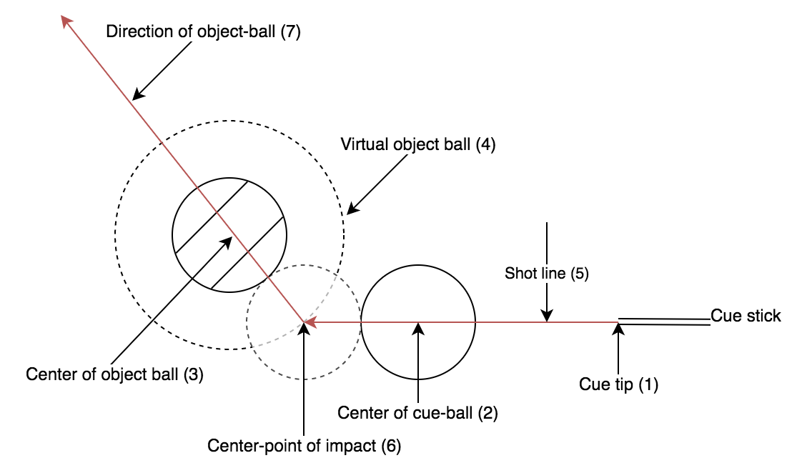

## Ideas

General idea is to calculate only the direction of the object ball (3) and projecting that on the table (7). 
To make this work you need the point of impact (6) of the cue-ball. 
This can be done by calculating the position of the cueball (2) when going near the object ball. 
We need to use intersection of the path of the cue-ball with the object-ball, where a virtual object-ball (4) is defined by twice the ratio from the 
center (3) of the object-ball.
The direction of the shot can be determined by sticking red tape on the tip of the cue-sticki (1). 
To detect the cue-ball we select the whitest ball. 
Calculate the shot-line using the center of the cue-ball (2) to and the center of the cue tip (1).




## Getting started

1. Install Python
2. Install the following packages

```bash
pip install cv2
pip install imutils
pip install mahotas
brew install freeimage
```

## Working samples
Basic circle detection based on 7 non-solid circles
```bash
python Werkende-cirkels.py
```

Detect balls in a high res stock photo
```bash
python pool-table-stock-werkend.py
```


## Helpful docs

Circle detection:
- https://docs.opencv.org/3.3.1/da/d53/tutorial_py_houghcircles.html
- https://www.pyimagesearch.com/2014/07/21/detecting-circles-images-using-opencv-hough-circles/

Binarize images:
- https://stackoverflow.com/questions/22700033/remove-features-from-binarized-image

Optimizing images
- Contrast and Brightness: https://docs.opencv.org/2.4/doc/tutorials/core/basic_linear_transform/basic_linear_transform.html